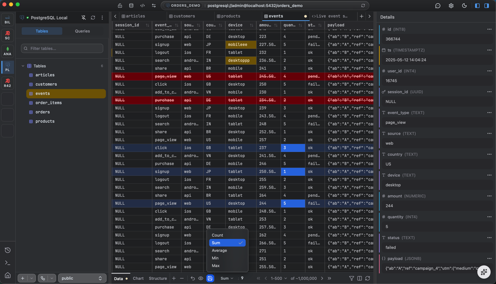

# FlexTable

**A fast, native desktop database client for PostgreSQL, MySQL, SQLite, MongoDB, and Redis.**

One workspace to browse, query, edit, visualize, and manage your databases, with SQL and NoSQL side by side.

  
  
  
  
  

  

---

> **This repository is the public home for FlexTable** - the **documentation** and the place to **report issues and share feedback**. Downloads and release notes live at [flextable.dev](https://flextable.dev).

## Why FlexTable

- **One editor for SQL and NoSQL** - write SQL for PostgreSQL, MySQL, and SQLite, shell-style queries for MongoDB, and commands for Redis, all in the same schema-aware editor with autocomplete.
- **Built for real data** - a virtualized grid that scrolls smoothly through millions of rows, with sort, filter, and a rich cell inspector (Formatted, JSON, Markdown, HTML, or Raw).
- **Safe, reviewable edits** - inline edits are staged and highlighted, then committed together as a single transaction. Review before anything hits the database, or roll back.
- **Native and fast** - a lightweight desktop app, not a browser tab, for every major platform.
- **Private by default** - your connections and data stay on your machine. No telemetry.

## Features

| Area | What you get |
|---|---|
| **Connect** | PostgreSQL, MySQL, SQLite, MongoDB, Redis. Organize connections into folders, favorite them, and see status at a glance. |
| **Secure** | SSL/TLS, SSH tunneling, and AWS RDS IAM authentication. |
| **Query** | Schema-aware autocomplete, SQL formatting, cancellable runs, saved queries with folders, and full run history. |
| **Browse & edit** | Fast data grid, powerful filters, a rich cell viewer, and staged edits with a transaction-mode toggle. |
| **Visualize** | Turn any result into a bar, line, area, pie, or scatter chart. |
| **Schema** | Structure view plus an auto-generated ER diagram, exportable as PNG, SVG, or DBML. |
| **MongoDB** | Browse collections and documents with Extended JSON, and run shell-style queries. |
| **Redis** | Keyspace browser for every value type, live Pub/Sub monitoring, and command execution. |
| **Import & export** | Move data in and out as CSV, JSON, SQL, or Excel. |
| **Backup & restore** | Snapshot and restore whole databases. |
| **AI assistant** | Generate and explain queries with your own API key (Anthropic, OpenAI, Google, OpenRouter, DeepSeek, GitHub Copilot, Ollama, or any OpenAI-compatible endpoint). Keys and requests go straight from the app to your provider. |

## Download & install

Grab the latest build for your platform from the [**download page**](https://flextable.dev/download).

| Platform | File |
|---|---|
| **macOS** | `FlexTable_<version>_aarch64.dmg` (Apple Silicon) or `_x64.dmg` (Intel) |
| **Windows** | `FlexTable_<version>_x64-setup.exe` |
| **Linux** | `.AppImage` (recommended) or `.deb` |

FlexTable checks for updates and installs them with a click. See the [changelog](https://flextable.dev/changelog) for what changed in each release.

> **Linux note:** in-app auto-updates require the **AppImage** build. A `.deb` is managed by your system package manager, so to update it you reinstall the newer `.deb` or switch to the AppImage.

## Documentation

Full guides live at **[docs.flextable.dev](https://docs.flextable.dev)** - installation, a quickstart, per-engine connection details, the query editor, charts, the ER diagram, import/export, backup, the AI assistant, security, and troubleshooting.

## Report a bug or request a feature

- **Found a bug?** [Open a bug report](../../issues/new?template=bug_report.yml)
- **Have an idea?** [Open a feature request](../../issues/new?template=feature_request.yml)
- **Question or general feedback?** [Start a discussion](../../discussions)

When reporting a bug, please include your **FlexTable version**, **OS**, and the **database engine** involved - it makes fixes much faster.

## Security & privacy

FlexTable runs entirely on your machine and talks only to the databases and the AI provider you configure. Connection details are stored locally and encrypted at rest, and the app ships with **no analytics or telemetry**. AI keys are never routed through FlexTable. See [Security and privacy](https://docs.flextable.dev/security-and-privacy) for details.

## Links

- Website: [flextable.dev](https://flextable.dev)
- Documentation: [docs.flextable.dev](https://docs.flextable.dev)
- Download: [flextable.dev/download](https://flextable.dev/download)
- Changelog: [flextable.dev/changelog](https://flextable.dev/changelog)
- Community: [Discussions](../../discussions)
